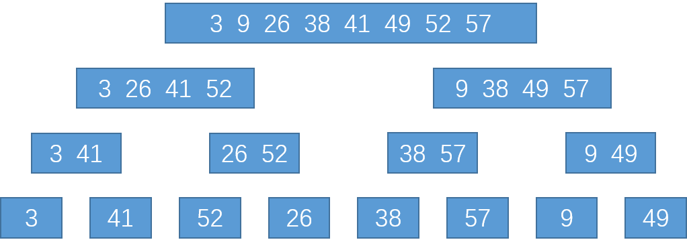

## 2.3-1

#### 题目

使用图2-4作为模型，说明归并排序在数据 $A=<3, 41, 52, 26, 38, 57, 9, 49>$ 上的操作。

#### 答案



## 2.3-2

#### 题目

重写过程MERGE，使之不使用哨兵，而是一旦数组 $L$ 或 $R$ 的所有元素均被复制会 $A$ 就立刻停止，然后把另一个数组的剩余部分复制回 $A$ 。

#### 答案

```python
MERGE(A, p, q, r)
n1 = q - p  + 1
n2 = r - q
初始化 L 和 R 分别为 n1元数组 和 n2元数组
for i = 1 to n1
    L[i] = A[p+i-1]
for j = 1 to n2
    R[j] = A[q + j]
i = 1
j = 1
flag = 0
for k = p to r    
    if L[i] <= R[j]
        A[k] = L[i]
        i = i+1
        if i > L.length:
            flag = 1
            break
    else
        A[k] = R[j]
        j = j + 1
        if j > R.length:
            flag = 2
            break
if flag == 1:      
	for m = k+1 to r
    	A[m] = R[m]
else:
    for m = k+1 to r
    	A[m] = L[m]
```

## 2.3-3

#### 题目

使用数学归纳法证明：当 $n$ 刚好是2的幂时，以下递归式的解是 $T(n)=n\log{n}$。
$$
T(n) =\left\{
\begin{aligned}
2,\hspace{1cm} &若n=2\\
2T(n/2)+n, \hspace{1cm} & 若n=2^k, k>1
\end{aligned}
\right.
$$

#### 答案

0. 假设 $T(n)=n\log{n}$ 成立。

1. 当 $n=2$ 时，显然有 $T(2)=2\log2=2$ 成立。

2. 假设当 $n=2^k$ 时有 $T(n)=n \log{n}$ 成立，则 
    $$
    \begin{aligned}
    T(2^{k+1})&=2T(2^{k+1}/2)+2^{k+1}\\
    &=2T(2^{k})+2^{k+1}\\
    &=2\times(T(2^k)+2^k)\\
    &=2\times(2^k\log{2^k}+2^k)\\
    &=2^{k+1}\times(\log2^k+1)\\
    &=2^{k+1}\times(\log2^k+\log2)\\
    &=2^{k+1}\log(2^{k+1})
    \end{aligned}
    $$
    即有 $T(n+1)=(n+1)\log{n}$ 成立，得证。

## 2.3-4

#### 问题

我们可以把插入排序表示为如下的一个递归过程。为了排序 $A[1\dots n]$，我们递归地排序 $A[1\dots {n-1}]$ ，然后把 $A[n]$ 插入已排序的数组 $A[1\dots {n-1}]$ 。为插入排序的这个递归版本的最坏情况运行时间写一个递归式。

#### 答案

$$
T(n) =\left\{
\begin{aligned}
\Theta(1),\hspace{1cm} &若n=1\\
T(n-1)+\Theta(1)+\Theta(n), \hspace{1cm} & 若n>1
\end{aligned}
\right.
$$

## 2.3-5

#### 题目

回顾查找问题（参见练习2.1-3），注意到，如果序列 $A$ 已经排好序，就可以将该序列中的中点与 $v$ 进行比较。根据比较的结果，原序列中有一半就可以不用再做进一步的考虑了。**二分查找**算法重复这个过程，每次都将序列剩余部门的规模减半。为二分查找写出迭代或递归的伪代码。证明：二分查找的最坏情况运行时间为 $\Theta(\log{n})$ 。

#### 答案

伪代码

```python
BINARY-SEARCH(A, v, p, q)
mid = (p+q)/2
if v == A[mid]:
    return mid
if p == q:
    return NULL
if v > A[mid]:
	return BINARY-SEARCH(A, v, mid, q)
else:
    return BINARY-SEARCH(A, v, p, mid)
```

证明
$$
该算法的递归式为：\\
T(n) =\left\{
\begin{aligned}
\Theta(1),\hspace{1cm} &若n=1\\
T(\frac{n}{2})+\Theta(1), \hspace{1cm} & 若n>1
\end{aligned}
\right.\\
假设T(n)=\Theta(\log{n}),\\
对于n=1，此时需要进行查找，显然有\log{1}=0成立；\\
假设n/2时有原假设成立，下面只需证明n时原假设成立即可。\\
根据递归式，有T(n)=T(n/2)=\log\frac{n}{2}=\log{n}-\log{2}=\Theta(\log{n})
$$

## 2.3-6

#### 题目

注意到2.1节中的过程INSERTION-SORT的第5~7行的while循环采用一种线性查找来（反向）扫描已经排序好的子数组 $A[1\dots j-1]$ 。我们可以使用二分查找（参见练习2.3-5）来把插入排序的最坏情况总运行时间该进到 $\Theta(n\log{n})$ 吗？

#### 答案